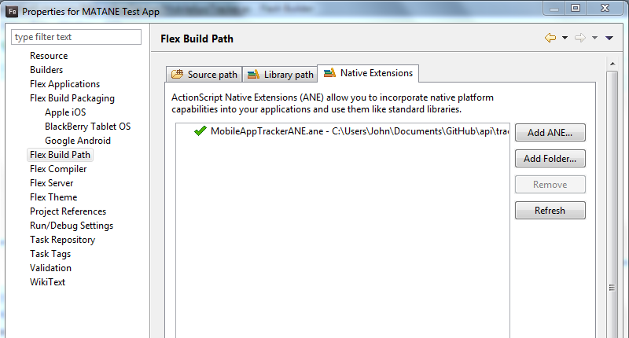
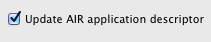
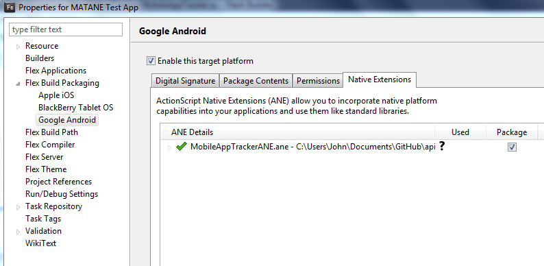
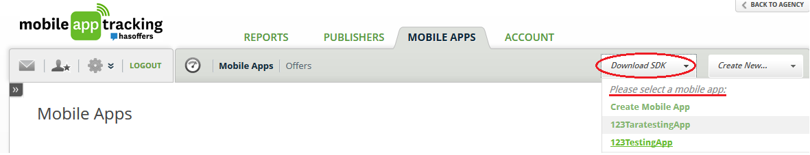
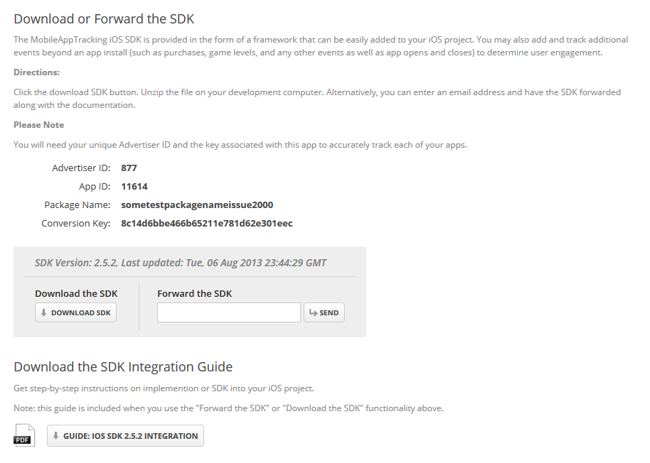

# MAT AIR Native Extension

The MobileAppTracking (MAT) ANE for Adobe AIR provides basic application install
and event tracking functionality via the MobileAppTracking SDKs. To track installs,
you must integrate the AIR Native Extension with your AIR app. Once the ANE is 
integrated and set to track installs, you can add and track additional events beyond
an app install (such as purchases, game levels, and any other user engagement).

This document outlines the AIR Native Extension integration and use cases.

## Implementation

1. To integrate the MobileAppTracking ANE in your AIR app, use the file MobileAppTrackerANE.ane
located in the /dist/ folder. Add this file as a Native Extension to your AIR app by right clicking
your project and selecting Properties->Flex Build Path->Native Extensions->Add ANE.

2. When adding the ANE, if available then you can select the Update AIR application descriptor checkbox.

3. If not available, then you can manually add the extension to your project’s .xml file like so:

		<extensions>
				<extensionID>com.hasoffers.MobileAppTracker</extensionID>
		</extensions>

4. Now enable your platforms from Properties->Flex Build Packaging->Apple iOS/Google Android and select “Enable this target platform”.

5. Then go to the Native Extensions tab and check the “Package” box next to the MobileAppTrackerANE ANE.

6. Now import the MobileAppTracker native extension into your AIR app’s Flex script. On app startup,
get the singleton instance of MobileAppTracker and then call the init method.

		import com.hasoffers.nativeExtensions.MobileAppTracker;
		public var mobileAppTracker:MobileAppTracker;

		mobileAppTracker = MobileAppTracker.instance;
		mobileAppTracker.init(“your_advertiser_id”, “your_advertiser_key”);

The “your_advertiser_id” and the “your_advertiser_key” values may be found on the “Tracking Code for XXXApp”
page by clicking on the “Download SDK” button and clicking on the appropriate mobile app.

__Android Permissions__

If your app will support Android, add the following permissions to your AIR project’s .xml file. It should look like this:

	<android>
	  <manifestAdditions>
	      <![CDATA[
	          <manifest android:installLocation="auto">
	              <uses-permission android:name="android.permission.ACCESS_NETWORK_STATE"/>
	              <uses-permission android:name="android.permission.ACCESS_WIFI_STATE"/>
	              <uses-permission android:name="android.permission.INTERNET"/>
	              <uses-permission android:name="android.permission.READ_PHONE_STATE"/>
	          </manifest>
	      ]]>
	  </manifestAdditions>
	</android>

You will also need to place our INSTALL_REFERRER receiver inside the application tag of your .xml manifest:

	<receiver android:name="com.mobileapptracker.Tracker" android:exported="true">
	   <intent-filter>
	       <action android:name="com.android.vending.INSTALL_REFERRER" />
	   </intent-filter>
	</receiver>

For more information on how MobileAppTracking uses the INSTALL_REFERRER, see [How Google Play Install Referrer Works](http://support.mobileapptracking.com/entries/22561636-how-google-play-install-referrer-works).

## Installs and Updates

As the success of attributing app events after the initial install is dependent upon first tracking that install,
we require that the install is the first event tracked. To track install of your mobile app, use the “trackInstall”
method. If users have already installed your app prior to SDK implementation, then these users should be tracked as updates.

### Track Installs

The “trackInstall” method is used to track when users install your mobile app on their device and will only record one
conversion per install in reports. You should call trackInstall() in the app's initialize method after
instantiating a MobileAppTracker class.

	mobileAppTracker.trackInstall();

The “trackInstall” method automatically tracks updates of your app if the app version differs from the last app version it saw.

### Handling Installs Prior to SDK Implementation - Track as Updates

What if your app already has thousands or millions of users prior to SDK implementation? What happens when these users update 
the app to the new version that contains the MAT SDK?

MAT provides you two ways to make sure that the existing users do not count towards new app installs.

1. Call SDK method "trackUpdate" instead of "trackInstall".

	If you are integrating MAT into an existing app where you have users you’ve seen before, you can track an update yourself with the trackUpdate() method.

		mobileAppTracker.trackUpdate();

2. Import prior installs to the platform.

These methods are useful if you already have an app in the store and plan to add the MAT SDK in a new version. 
Learn how to [handle installs prior to SDK implementation here](http://support.mobileapptracking.com/entries/22621001-Handling-Installs-prior-to-SDK-implementation).

If the code used to differentiate installs versus app updates is not properly implemented, then you will notice 
a [spike of total installs](http://support.mobileapptracking.com/entries/22900598-Spike-of-Total-Installs-on-First-day-of-SDK) on the first day of the SDK implementation.

## Events

After the install has been tracked, the “trackAction” method is intended to be used to track user actions such as reaching a 
certain level in a game or making an in-app purchase. The “trackAction” method allows you to define the event name dynamically.

All "trackAction" methods are used in the following format:

	trackAction(event:String, revenue:Number=0, currency:String="USD", refId:String=null, isEventId:Boolean=false):void

You need to supply the "event" field with the appropriate value for the event; e.g. "registration". If the event does
not exist, it will be dynamically created in our site and incremented. You may pass a revenue value, currency code,
reference id, or whether you are using an event ID or event name, as optional fields.

The reference id is an optional parameter that you supply to use for reconciliation - on a purchase event, it could be
their order ID or something else you track. This is called "Advertiser Ref ID" in our reporting, and accessed as
{advertiser_ref_id} as a postback variable.

### Registration

If you have a registration process, it's recommended to track it by calling trackAction set to “registration”.

	mobileAppTracker.trackAction("registration");
	// trackAction overload with additional info
	mobileAppTracker.trackAction("registration", 0, "USD", "123", false);

You can find these events in the platform by viewing Reports > Event Logs. Then filter the report by the “registration” event.

While our platform always blocks the tracking of duplicate installs, by default it does not block duplicate event requests. 
However, a registration event may be an event that you only want tracked once per device/user. 
Please see [block duplicate requests setting for events](http://support.mobileapptracking.com/entries/22927312-Block-Duplicate-Request-Setting-for-Events) for further information.

### Purchases

The best way to analyze the value of your publishers and marketing campaigns is to track revenue from in-app purchases.
By tracking in-app purchases for a user, the data can be correlated back to the install and analyzed on a cohort basis 
to determine revenue per install and lifetime value.

	mobileAppTracker.trackAction("purchase");
	mobileAppTracker.trackAction("purchase", 0.99, "USD", "123", false);

__Track In-App Purchases__
The basic way to track purchases is to track an event with a name of purchase and then define the revenue (sale amount) and currency code.

Note: Pass the revenue in as a Double and the currency of the amount if necessary.  Currency is set to "USD" by default.
See [Setting Currency Code](http://support.mobileapptracking.com/entries/23697946-Customize-SDK-Settings) for currencies we support.

You can find these events in platform by viewing Reports > Logs > Events. Then filter the report by the “purchase” event.

### Opens

The SDK allows you to analyze user engagement by tracking unique opens. The SDK has built in functionality to only track one “open” event
per user on any given day to minimize footprint. All subsequent “open” events fired on the same day are ignored and will not show up on the platform.

	mobileAppTracker.trackAction("open");
	mobileAppTracker.trackAction("open", 0, "USD", "123", false);

You can find counts of Opens by viewing Reports > Mobile Apps. Include the parameter of Opens to see the aggregated count.
The platform does not provide logs of Opens. If you track Opens using a name other than "open" then these tracked events will
cost the same price as all other events to track.

### Other Events

You can track other events in your app dynamically by calling “trackAction”. The “trackAction” method is intended for tracking
any user actions. This method allows you to define the event name.

To dynamically track an event, replace “event name or action” with the name of the event you want to track. The tracking engine
will then look up the event by the name. If an event with the defined name doesn’t exist, the tracking engine will automatically
create an event for you with that name. An Event Name has to be alphanumeric.

You can pass in an event name or event id. If you pass in an event name and isEventId = false, then you are indicating to the SDK that
you want your own event name passed in. If you pass in an event id and isEventId = true, then you are indicating that you have a 
pre-defined event id in the platform that you associate the action with.

You can find these events in platform by viewing Reports->Logs->Event Logs.

The max event limit per site is 100. Learn more about the [max limit of events](http://support.mobileapptracking.com/entries/22803093-Max-Event-Limit-per-Site).

While our platform always blocks the tracking of duplicate installs, by default it does not block duplicate event requests. 
However, there may be other types of events that you only want tracked once per device/user. Please see [block duplicate requests setting for events](http://support.mobileapptracking.com/entries/22927312-Block-Duplicate-Request-Setting-for-Events) for further information.

## Testing Plugin Integration with SDK

These pages contain instructions on how to test whether the SDKs were successfully implemented for the various platforms:

[Testing Android SDK Integration](http://support.mobileapptracking.com/entries/22541781-Testing-Android-SDK-integration)

[Testing iOS SDK Integration](http://support.mobileapptracking.com/entries/22561876-testing-ios-sdk-integration)

## Debug Mode and Duplicates

__Debugging__

When the Debug mode is enabled in the SDK, the server responds with debug information about the success or failure of the
tracking requests.

__Note__: For Android, debug mode log output can be found in LogCat under the tag "MobileAppTracker".

To debug log messages that show the event status and server response, call the "setDebugMode" method with Boolean true:

	mobileAppTracker.setDebugMode(true);

__Allow Duplicates__

The platform rejects installs from devices it has seen before.  For testing purposes, you may want to bypass this behavior
and fire multiple installs from the same testing device.
 
There are two methods you can employ to do so: (1) calling the "setAllowDuplicates" method, and (2) set up a test profile.

(1) Call the “setAllowDuplicates” after initializing MobileAppTracker, with Boolean true:

	mobileAppTracker.setAllowDuplicateRequests(true);

(2) Set up a [test profile](http://support.mobileapptracking.com/entries/22541401-Test-Profiles). A Test Profile should be 
used when you want to allow duplicate installs and/or events from a device you are using from testing and don't want to 
implement setAllowDuplicateRequests in the code and instead allow duplicate requests from the platform.

**_The setDebugMode and setAllowDuplicates calls are meant for use only during debugging and testing. Please be sure to disable these for release builds._**

## Additional Resources

### Custom Settings

The SDK supports several custom identifiers that you can use as alternate means to identify your installs or events.
Call these setters before calling the corresponding trackInstall or trackAction code.

__OpenUDID__ (iOS only, deprecated - use setAppleAdvertisingIdentifier instead)

This sets the OpenUDID of the device. Can be generated with the official implementation at [http://OpenUDID.org](http://OpenUDID.org).
Calling this will do nothing on Android apps.

	mobileAppTracker.setOpenUDID("your_open_udid");

__TRUSTe ID__

If you are integrating with the TRUSTe SDK, you can pass in your TRUSTe ID with setTRUSTeId, which populates the “TPID” field.

	mobileAppTracker.setTRUSTeId("your_truste_id");

__User ID__

If you have a user ID of your own that you wish to track, pass it in as a string with setUserId. This populates the “User ID”
field in our reporting, and also the postback variable {user_id}.

	mobileAppTracker.setUserID("custom_user_id");

The SDK supports several custom identifiers that you can use as alternate means to identify your installs or events.
Please navigate to the [Custom SDK Settings](http://support.mobileapptracking.com/entries/23738686-Customize-SDK-Settings) page for more information.

### Event Items

While an event is like your receipt for a purchase, the event items are the individual items you purchased.
Event items allow you to define multiple items for a single event. The “trackAction” method can include this event item data.

The method "trackActionWithEventItem" allows you to pass in an array of mappings of item, unit price, quantity and revenue
strings, which we call an “event item” that is associated with the event.

It contains these default values so you may omit these parameters in the tracking call if you are not using them.

	trackActionWithEventItem(
		event:String,
		eventItems:Array,
		revenue:Number=0,
		currency:String="USD",
		refId:String=null,
		isEventId:Boolean=false,
		transactionState:int=0,
		receipt:String=null,
		receiptSignature:String=null):void

__Parameters:__

- event - the event name associated with the event
- eventItems - an array of event items
- revenue - the revenue amount associated with the event
- currency - the ISO 4217 currency code for the revenue
- refId - the advertiser reference ID you would like to associate with this event
- isEventId - whether the event ID (true) or event name (false) is being passed in
- transactionState - the purchase status received from app store
- receipt - the receipt data from iTunes/Google Play
- receiptSignature - the receipt signature from Google Play, not used on iOS

For example, here we add an event item of two bananas for a total of $1.00:

	var eventItems:Array = new Array();
	
	var dict:Dictionary = new Dictionary();
	dict["item"] = "banana";
	dict["unit_price"] = "0.50";
	dict["quantity"] = "2";
	dict["revenue"] = "1.00";
	
	eventItems.push(dict); // you may add any additional event items to the array
	                       // formatted like above
	
	// If we have an id we want to associate with this event, pass in refId field
	String refId = "some_order_id";

	// Total event revenue = sum of even item revenues in arr + extraRevenue
	float extraRevenue = 0; // default to zero
	
	// Transaction state may be set to the value received from iOS/Android app store when a purchase transaction is finished.
	int transactionState = 1;

	// Receipt data, receipt signature are from iOS/Android app store and used for purchase verification.
	string receiptData = null;
	string receiptSignature = null;
	
	mobileAppTracker.trackActionWithEventItem("eventName", eventItems, extraRevenue, "USD", refId, false, transactionState, receiptData, receiptSignature);

### App to App Tracking

App to App tracking provides the ability for one app (the referring app) to download another app (the target app). 
The target app will then record an install event that contains data from the referring app. Also, you can specify that your 
app (AppA - referring app) redirect to the link where AppB (target app) can be downloaded (typically this is Google Play or iTunes).

If your app has a referral to another app, upon click of that link you should call "startAppToAppTracking" and pass in the referred app’s package name.

With "doRedirect" set to true, the download url will immediately be opened.
If you want to handle this yourself, you can set "doRedirect" to false.

	startAppToAppTracking(targetAppId:String, advertiserId:String, offerId:String, publisherId:String, shouldRedirect:Boolean):void

Example:

	mobileAppTracker.startAppToAppTracking("com.referred.app", “877”, “123”, “456”, true);

__Parameters:__

- targetAppId - the target package name or bundle ID of the app being referred to
- advertiserId - the advertiser ID of the publisher app in our system
- offerId - the offer ID for referral
- publisherId - the publisher ID for referral
- shouldRedirect - if "true", this method will automatically open the destination URL for the target package name

If supporting Android, you will also need to add a MATProvider to your original app’s AndroidManifest
(add as a ManifestAddition in your AIR project’s .xml file). Place the provider inside the tags with the package
names of the apps accessing referral information:

	<provider android:name="com.mobileapptracker.MATProvider" android:authorities="com.referred.app" />

### Building the ANE

The following tools are required to build the MobileAppTracking ANE:

__Adobe AIR__

[http://get.adobe.com/air/](http://get.adobe.com/air/)

__Adobe Flex SDK__

[http://www.adobe.com/devnet/flex/flex-sdk-download.html](http://www.adobe.com/devnet/flex/flex-sdk-download.html)

__Android SDK__

[http://developer.android.com/sdk/index.html](http://developer.android.com/sdk/index.html)

In the /build/ folder, open the build.config file and set your system paths for flex.sdk, android.sdk and android.platformtools.

Then from /build/, run 'ant' which will create a MobileAppTrackerANE.ane file in the /bin/ folder.